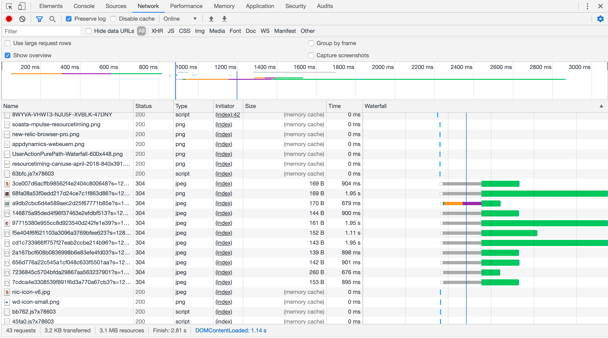
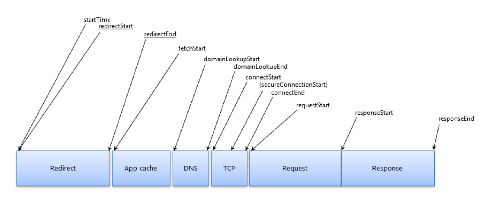

# web-performance-analysis

参考资料：https://nicj.net/navigationtiming-in-practice/ https://nicj.net/resourcetiming-in-practice/

## 1. 介绍

ResourceTiming 是 W3C Web Performance working group  的 一个规范，目标是为了得到一个准确性能指标，对所有的资源下载页面加载期间的经历,比如图像、CSS和JavaScript。

ResourceTiming基于NavigationTiming，提供了更多的测量标准，例如，DNS, TCP, request, response 阶段, 和 “loaded” timestamp.

ResourceTiming灵感来自资源加载瀑布图，瀑布图展示了所有网络资源获取的时间表，可以快速的看到一些问题。下图是一个 Chrome Developer Tools的例子：



可以根据下图分成几个时间段



- name is the fully-resolved URL of the attribute (relative URLs in your HTML will be expanded to include the full protocol, domain name and path)
- entryType will always be "resource" for ResourceTiming entries
- startTime is the time the resource started being fetched
- duration is the overall time required to fetch the resource
- initiatorType is the localName of the element that initiated the fetch of the resource (see details below)
- nextHopProtocol: ALPN Protocol ID such as http/0.9 http/1.0 http/1.1 h2 hq spdy/3 (ResourceTiming Level 2)
- workerStart is the time immediately before the active Service Worker received the fetch event, if a ServiceWorker is installed
- redirectStart and redirectEnd encompass the time it took to fetch any previous resources that redirected to the final one listed. If either timestamp is 0, there were no redirects, or one of the redirects wasn’t from the same origin as this resource.
- fetchStart is the time this specific resource started being fetched, not including redirects
- domainLookupStart and domainLookupEnd are the timestamps for DNS lookups
- connectStart and connectEnd are timestamps for the TCP connection
- secureConnectionStart is the start timestamp of the SSL handshake, if any. If the connection was over HTTP, or if the browser doesn’t support this timestamp (eg. Internet Explorer), it will be 0.
- requestStart is the timestamp that the browser started to request the resource from the remote server
- responseStart and responseEnd are the timestamps for the start of the response and when it finished downloading
- transferSize: Bytes transferred for the HTTP response header and content body (ResourceTiming Level 2)
- decodedBodySize: Size of the body after removing any applied content-codings (ResourceTiming Level 2)
- encodedBodySize: Size of the body after prior to removing any applied content-codings (ResourceTiming Level 2)


### Initiator Types

- img
- link
- script
- css: url(), @import
- xmlhttprequest
- iframe (known as subdocument in some versions of IE)
- body
- input
- frame
- object
- image
- beacon
- fetch
- video
- audio
- source
- track
- embed
- eventsource
- navigation
- other
- use

以下是常用HTML elements and JavaScript APIs的initiatorType对照关系：

```js
: img
: img
<link rel="stylesheet" href="...">: link
<link rel="prefetch" href="...">: link
<link rel="preload" href="...">: link
<link rel="prerender" href="...">: link
<link rel="manfiest" href="...">: link
<script src="...">: script
CSS @font-face { src: url(...) }: css
CSS background: url(...): css
CSS @import url(...): css
CSS cursor: url(...): css
CSS list-style-image: url(...): css
<body background=''>: body
<input src=''>: input
XMLHttpRequest.open(...): xmlhttprequest
<iframe src="...">: iframe
<frame src="...">: frame
<object>: object
<svg><image xlink:href="...">: image
<svg><use>: use
navigator.sendBeacon(...): beacon
fetch(...): fetch
<video src="...">: video
<video poster="...">: video
<video><source src="..."></video>: source
<audio src="...">: audio
<audio><source src="..."></audio>: source
<picture><source srcset="..."></picture>: source
<picture></picture>: img
<picture></picture>: img
<track src="...">: track
<embed src="...">: embed
favicon.ico: link
EventSource: eventsource
```

### Cached Resources

以下这个方法可以判断，是否命中了缓存（This algorithm isn’t perfect, but probably covers 99% of cases）：

```js
function isCacheHit() {
  // if we transferred bytes, it must not be a cache hit
  // (will return false for 304 Not Modified)
  if (transferSize > 0) return false;

  // if the body size is non-zero, it must mean this is a
  // ResourceTiming2 browser, this was same-origin or TAO,
  // and transferSize was 0, so it was in the cache
  if (decodedBodySize > 0) return true;

  // fall back to duration checking (non-RT2 or cross-origin)
  return duration < 30;
}
```

### 304 Not Modified

```js
function is304() {
  if (encodedBodySize > 0 &&
      tranferSize > 0 &&
      tranferSize < encodedBodySize) {
    return true;
  }

  // unknown
  return null;
}
```

### Blocking Time

```js
var blockingTime = 0;
if (res.connectEnd && res.connectEnd === res.fetchStart) {
    blockingTime = res.requestStart - res.connectEnd;
} else if (res.domainLookupStart) {
    blockingTime = res.domainLookupStart - res.fetchStart;
}
```

## 2. http2 性能优化

1. 二进制分帧

http1.x诞生的时候是明文协议，其格式由三部分组成：start line（request line或者status line），header，body。要识别这3部分就要做协议解析，http1.x的解析是基于文本。基于文本协议的格式解析存在天然缺陷，文本的表现形式有多样性，要做到健壮性考虑的场景必然很多，二进制则不同，只认0和1的组合。基于这种考虑http2.0的协议解析决定采用二进制格式，实现方便且健壮。

http2.0用binary格式定义了一个一个的frame，和http1.x的格式对比如下图：


http2.0的格式定义更接近tcp层的方式，这张二机制的方式十分高效且精简。

length定义了整个frame的开始到结束

type定义frame的类型（一共10种）

flags用bit位定义一些重要的参数

stream id用作流控制

payload就是request的正文了

为什么么能在不改动 HTTP/1.x 的语义、方法、状态码、URI 以及首部字段….. 的情况下, HTTP/2 是如何做到「突破 HTTP1.1 的性能限制，改进传输性能，实现低延迟和高吞吐量」？

关键之一就是在 应用层(HTTP/2)和传输层(TCP or UDP)之间增加一个二进制分帧层。


对它们采用二进制格式的编码 ，其中 HTTP1.x 的首部信息会被封装到 HEADER frame，而相应的 Request Body 则封装到 DATA frame 里面。
HTTP/2 通信都在一个连接上完成，这个连接可以承载任意数量的双向数据流。

在过去， HTTP 性能优化的关键并不在于高带宽，而是低延迟。TCP 连接会随着时间进行自我「调谐」，起初会限制连接的最大速度，如果数据成功传输，会随着时间的推移提高传输的速度。这种调谐则被称为 TCP 慢启动。具体复习：《再深谈TCP/IP三步握手&四步挥手原理及衍生问题—长文解剖IP》、《从网卡发送数据再谈TCP/IP协议—网络传输速度计算-网卡构造》

由于这种原因，让原本就具有突发性和短时性的 HTTP 连接变的十分低效。

HTTP/2 通过让所有数据流共用同一个连接，可以更有效地使用 TCP 连接，让高带宽也能真正的服务于 HTTP 的性能提升。
总结：

单连接多资源的方式，减少服务端的链接压力,内存占用更少,连接吞吐量更大

由于 TCP 连接的减少而使网络拥塞状况得以改善，同时慢启动时间的减少,使拥塞和丢包恢复速度更快


2. 多路复用 (Multiplexing)||连接共享

多路复用允许同时通过单一的 HTTP/2 连接发起多重的请求-响应消息。
众所周知 ，在 HTTP/1.1 协议中 「浏览器客户端在同一时间，针对同一域名下的请求有一定数量限制。超过限制数目的请求会被阻塞」。

Clients that use persistent connections SHOULD limit the number of simultaneous connections that they maintain to a given server. A single-user client SHOULD NOT maintain more than 2 connections with any server or proxy. A proxy SHOULD use up to 2*N connections to another server or proxy, where N is the number of simultaneously active users. These guidelines are intended to improve HTTP response times and avoid congestion.

source：RFC-2616-8.1.4 Practical Considerations

比如TCP建立连接时三次握手有1.5个RTT（round-trip time）的延迟，为了避免每次请求的都经历握手带来的延迟，应用层会选择不同策略的http长链接方案。又比如TCP在建立连接的初期有慢启动（slow start）的特性，所以连接的重用总是比新建连接性能要好。

一个request对应一个stream并分配一个id，这样一个连接上可以有多个stream，每个stream的frame可以随机的混杂在一起，接收方可以根据stream id将frame再归属到各自不同的request里面。因而 HTTP/2 能多路复用(Multiplexing) ，允许同时通过单一的 HTTP/2 连接发起多重的请求-响应消息。


因此 HTTP/2 可以很容易的去实现多流并行而不用依赖建立多个 TCP 连接，HTTP/2 把 HTTP 协议通信的基本单位缩小为一个一个的帧，这些帧对应着逻辑流中的消息。并行地在同一个 TCP 连接上双向交换消息。

前面还提到过连接共享之后，需要优先级和请求依赖的机制配合才能解决关键请求被阻塞的问题。http2.0里的每个stream都可以设置又优先级（Priority）和依赖（Dependency）。优先级高的stream会被server优先处理和返回给客户端，stream还可以依赖其它的sub streams。优先级和依赖都是可以动态调整的。动态调整在有些场景下很有用，假想用户在用你的app浏览商品的时候，快速的滑动到了商品列表的底部，但前面的请求先发出，如果不把后面的请求优先级设高，用户当前浏览的图片要到最后才能下载完成，显然体验没有设置优先级好。同理依赖在有些场景下也有妙用。


3. 首部压缩（Header Compression）

http1.x的header由于cookie和user agent很容易膨胀，而且每次都要重复发送。

HTTP/1.1并不支持 HTTP 首部压缩，为此 SPDY 和 HTTP/2 应运而生

这里普及一个小知识点。现在大家都知道tcp有slow start的特性，三次握手之后开始发送tcp segment，第一次能发送的没有被ack的segment数量是由initial tcp window大小决定的。这个initial tcp window根据平台的实现会有差异，但一般是2个segment或者是4k的大小（一个segment大概是1500个字节），也就是说当你发送的包大小超过这个值的时候，要等前面的包被ack之后才能发送后续的包，显然这种情况下延迟更高。intial window也并不是越大越好，太大会导致网络节点的阻塞，丢包率就会增加，具体细节可以参考IETF这篇文章。http的header现在膨胀到有可能会超过这个intial window的值了，所以更显得压缩header的重要性。

压缩算法的选择
SPDY/2使用的是gzip压缩算法，但后来出现的两种攻击方式BREACH和CRIME使得即使走ssl的SPDY也可以被破解内容，最后综合考虑采用的是一种叫HPACK的压缩算法。这两个漏洞和相关算法可以点击链接查看更多的细节，不过这种漏洞主要存在于浏览器端，因为需要通过javascript来注入内容并观察payload的变化。

现在SPDY 使用的是通用的DEFLATE 算法，而 HTTP/2 则使用了专门为首部压缩而设计的 HPACK 算法。

http2.0使用encoder来减少需要传输的header大小，通讯双方各自cache一份header fields表，既避免了重复header的传输，又减小了需要传输的大小。高效的压缩算法可以很大的压缩header，减少发送包的数量从而降低延迟。


服务端推送（Server Push）

服务端推送是一种在客户端请求之前发送数据的机制。在 HTTP/2 中，服务器可以对客户端的一个请求发送多个响应。Server Push 让 HTTP1.x 时代使用内嵌资源的优化手段变得没有意义；如果一个请求是由你的主页发起的，服务器很可能会响应主页内容、logo 以及样式表，因为它知道客户端会用到这些东西。这相当于在一个 HTML 文档内集合了所有的资源，不过与之相比，服务器推送还有一个很大的优势：可以缓存！也让在遵循同源的情况下，不同页面之间可以共享缓存资源成为可能。


http2.0引入RST_STREAM类型的frame，可以在不断开连接的前提下取消某个request的stream，表现更好。

重置连接表现更好
很多app客户端都有取消图片下载的功能场景，对于http1.x来说，是通过设置tcp segment里的reset flag来通知对端关闭连接的。这种方式会直接断开连接，下次再发请求就必须重新建立连接。http2.0引入RST_STREAM类型的frame，可以在不断开连接的前提下取消某个request的stream，表现更好。

流量控制（Flow Control）
TCP协议通过sliding window的算法来做流量控制。发送方有个sending window，接收方有receive window。http2.0的flow control是类似receive window的做法，数据的接收方通过告知对方自己的flow window大小表明自己还能接收多少数据。只有Data类型的frame才有flow control的功能。对于flow control，如果接收方在flow window为零的情况下依然更多的frame，则会返回block类型的frame，这张场景一般表明http2.0的部署出了问题。

更安全的SSL
HTTP2.0使用了tls的拓展ALPN来做协议升级，除此之外加密这块还有一个改动，HTTP2.0对tls的安全性做了近一步加强，通过黑名单机制禁用了几百种不再安全的加密算法，一些加密算法可能还在被继续使用。如果在ssl协商过程当中，客户端和server的cipher suite没有交集，直接就会导致协商失败，从而请求失败。在server端部署http2.0的时候要特别注意这一点。
